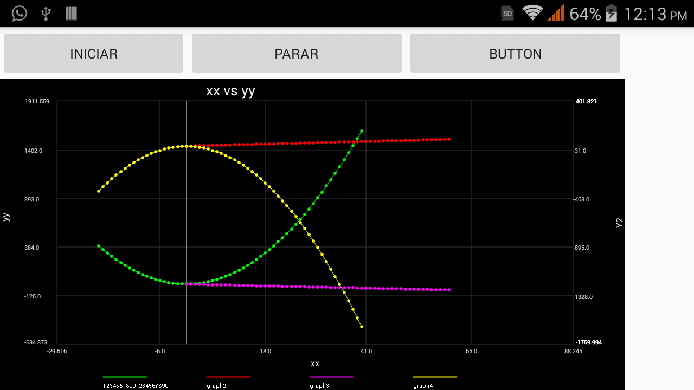
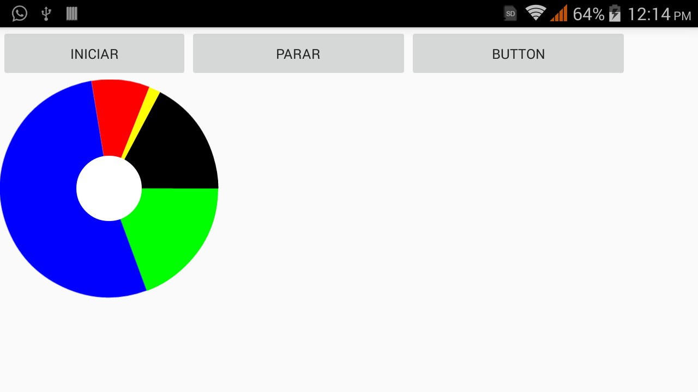

# JPLOT (android Y WindowsMobile10)
JPLOT  es una librería para graficar Puntos(x,y) ya sea graficos estaticos o Series de tiempo, ademas de graficos circulares (ya se desarrolla la opción de graficos de barras). Esta libreria es para Android y Windows mobile 10(en desarrollo). Existen varias librerias para graficar datos en android como AchartEngine, GraphView ,AndroidPlot, AFreeChart etc. ¿porque jplot? "ES LA MAS SIMPLE DE USAR Con 3 lineas ya se tiene un gráfico" Alta personalización en los gráficos y buena estética, ademas esta en Español.

## proximamente aun esta en desarrollo

## Como Agregar a mi proyecto Android Studio

##  Gráfico con Series de Puntos (x,y)
### Gráfico Estático
      private Plot2D grafica=Plot2D(context,"xx vs yy","xx","yy");
      grafica.SetSerie1(Xd,Yd,"graph1",0,true);
### Gráfico Dinámico
### Métodos Publicos que ayudan a configurar el panel de graficado
>el siguiente metodo se usa para
* public void SetSerie1( float[] xvalues, float[] yvalues,String Titulo,int tp,boolean Unirpuntos)  
>ahora tenemos otro metodo
* public void SetSerie2(float[] xvalues, float[] yvalues,String Titulo ,int tp ,boolean Unirpuntos,int eje)  
>siguiente emtodo
* public void SetSerie3(float[] xvalues, float[] yvalues,String Titulo ,int tp ,boolean Unirpuntos,int eje)
* public void SetSerie4(float[] xvalues, float[] yvalues,String Titulo ,int tp ,boolean Unirpuntos,int eje)
* public void SetEjey2(String tituloy2)
* public void SetEscalaAutomatica(boolean auto)
* public void SetEscalaX(double minX,double maxX)
* public void SetEscalaY1(double minY1,double maxY1)
* public void SetEscalaY2(double minY2,double maxY2)
* public void SetShowEjey2(boolean mostrar)
* public void SetHD(boolean hd)
--------------------------------------------------------------------------------------
los siguientes metodos ajustan el tamaño de texto
> public void  SetSizeTextX(int z)
> public void  SetSizeTextY1(int z)
> public void  SetSizeTextY2(int z)
> public void  SetSizeTitulo(int z)
> public void  SetSizeTituloX(int z)
> public void  SetSizeTituloY1(int z)
> public void  SetSizeTituloY2(int z)
> public void SetSizeLeyend(int z)
-------------------------------------------------------------------------------------
>public void SetGruesoLinea(int g)
 Ajusta el grueso de la linea que une los puntos.

Los siguientes métodos ajustan colores en el gráfico reciben 3 parametros de tipo entero r=rojo, g=verde, b=azul
>public void SetColorFondo(int r,int g,int b)      
>public void SetColorEjes(int r,int g,int b)        
>public void SetColorCuadricula(int r, int g, int b)
>public void SetColorTitulo(int r,int g,int b)      
>public void SetColorTituloX(int r,int g,int b)    
>public void SetColorTituloY(int r,int g,int b)    
>public void SetColorTituloY2(int r,int g,int b)    
>public void SetColorTextX(int r, int g, int b)   
>public void SetColorTextY1(int r, int g, int b)   
>public void SetColorTextY2(int r, int g, int b)  
>public void SetColorSerie1(int r, int g, int b)
>public void SetColorSerie2(int r, int g, int b)
>public void SetColorSerie3(int r, int g, int b)
>public void SetColorSerie4(int r, int g, int b)

## Gráfico de Pastelito
### Métodos Publicos que ayudan a configurar el gráfico
* public void SetDatos(float[] datapoints,String [] etiquetas  ) 
* public void SetColorTitulo(int r,int g, int b)
* public void SetColorAcot(int r, int g, int b)
* public void SetColorTextGrafico(int r,int g,int b)
* public void SetColorFondo(int r, int g,int b)
* public void SetSizeTitulo(int s)
* public void SetSizeAcot(int s)
* public void SetSizeTextGrafico(int s)
* public void SetSizeTitulo(String t)
* public void SetShowPorcentajes(boolean p)
* public void SetHD(boolean hd)
       
